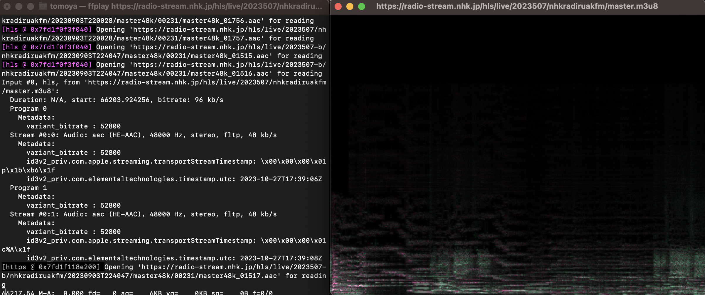

# 2023 Media Art Programming 4th

## Slides



 slides (PDF) 

slides (HTML)

## Shells and Pipes

Previously we have used basic commands such as `ls` and `cd`, which take terminal text input and return text output to the terminal.

On Unix-like operating systems, the input and output of commands with simple functions can be combined to perform complex operations using a feature called **pipes**.

Take, for example, the command `say`, which can be used on macOS to read text aloud.

The following command will cause macOS to say "Hello" aloud.

```sh
say "Hello".
```

Here, a program called say receives the text `"hello"` from **standard input (stdin)**.

So what happens if there is no input at all?

```sh
say
```

When executed without input, the say command enters a mode in which it waits for text input. Here, typing "hello" and then pressing the Enter key will cause the command to read out the text. When it finishes reading, it waits for text input again.

Standard input is often given in the form of a first argument or otherwise entered by the user from the terminal when the program is executed.

A pipe can be used here to pass the result of another command to say as standard input.

```sh
echo "hello" | say
```

The `echo`` command simply writes arbitrary text to standard output, while ``say`` is executed without arguments as before, but instead of going into interactive mode, it reads the "hello" given by ``echo` and exits.

Instead of `echo`, you can use a command that writes a file to standard output, such as `cat hogehoge.txt`, to read an arbitrary text file.

## Files and Devices

By the way, files on storage are not the only things that `cat` can open; Unix-like operating systems can also take hardware information on your computer (e.g., CPU temperature, hard disk RPM, etc.) just as they can handle files.

These devices reside in the `/dev` directory. This directory is not accessible from the Finder.

```sh
ls /dev
```

There are many devices out there, but it is difficult to guess their contents from their names. Let's try to use `urandom`, a hardware random number generator on your computer.

On computers, random numbers are often treated as algorithmic sequences of numbers, which means that knowing the initial value of a random number can predict subsequent random number sequences, so security-critical random number generation is often based on time or hardware random number generators.

Since opening with `cat` produces a tremendous number of random numbers and causes the terminal to freeze, let's use the head command to extract only the first few lines. Since `urandom` writes out random numbers as binary, it will include many that cannot be encoded as strings.

```sh
head /dev/urandom
```

And although not available today, in the past Linux had a virtual device called `/dev/dsp` that could write waveform data directly to the audio driver when written via pipe. Currently in Linux, the command `aplay` can do the same thing.

There is an attempt to take advantage of this mechanism, called **Bytebeat**, to generate sound in as short and simple a program as possible.

## Bytebeat



Bytebeat was first published by viznut in 2011 in a video on Youtube, which spread through commentary on his blog.

[Algorithmic symphonies from one line of code -- how and why?(2011)](http://countercomplex.blogspot.com/2011/10/algorithmic-symphonies-from- one-line-of.html)

Later, several environments were created that allow similar code to be executed on a web browser.

https://greggman.com/downloads/examples/html5bytebeat/html5bytebeat.html

https://sarpnt.github.io/bytebeat-composer


Let's try Bytebeat the old-fashioned (?) way of actually creating binary data. Let's try it the old-fashioned (?) way of actually creating binary data.

Bytebeat was originally created with the following C program.

```c
main(t){for(;;t++)putchar(((t<<1)^((t<<1)+(t>>7)&t>>12))|t>>(4-(1^7&(t>>>19)))|t>>7);}
```

This C code is compressed to the extreme, so if we write it a little more carefully, it looks like this

```c
int main(int t){
    for(;;t++){
    putchar(((t<<1)^((t<<1)+(t>>7)&t>>12))|t>>(4-(1^7&(t>>>19)))|t>>7);
    }
}
```

C program defines a function called `main`, which is the entrance to be executed by the program.
In an infinite loop with `for`, `t` starts at 0 at the beginning of the program and is increased by 1 for each loop. So this is the virtual time.

`putchar` is one of the most primitive functions in C, writing a single byte of data to the standard output.
When this t is calculated with various operations, one byte of data (0~255) is output as the value of one sample waveform (≈voltage, air pressure).

Data written to `/dev/dsp` is interpreted as 1 byte 1 sample with a sampling rate of 8000 Hz.

This time, we will use Node.js instead of C, which is difficult to build an environment for, and a program called `ffmpeg` so that it can be run outside of Linux.

## What is ffmpeg?

`ffmpeg` is a tool for converting files and data streams of various formats.
For example, you can convert a wav file to an mp3 file, receive internet radio and export it to a file, or conversely, play an audio file and host internet radio.

Because of its modularity and ability to convert so many different formats, it is no exaggeration to say that ffmpeg is behind most of the distribution services in the world.

### Installing ffmpeg

You can install `ffmpeg` with Homebrew. Please note that it takes a long time because of many dependent libraries.

```sh
brew install ffmpeg
```

### ffmpeg and ffplay commands

When you install `ffmpeg`, you can use the command `ffplay` at the same time.

ffplay` is a universal audio/video playback tool that allows you to play the second part of ffmpeg on your system instead of exporting or streaming files.

For example, you can use the following commands to play a normal audio file.

```sh
ffplay hoge.wav
```

You can also listen to Internet radio. You can receive NHK-FM (Tokyo) by opening the following URL. [^nhkurl]

[^nhkurl]: You can get a list of URLs for NHK web radio here.　http://www.nhk.or.jp/radio/config/config_web.xml

```sh
ffplay https://radio-stream.nhk.jp/hls/live/2023507/nhkradiruakfm/master.m3u8
```

During playback, the standard view of the frequency distribution is the spectrogram.



Pressing the w key with focus on this window allows you to switch between modes of waveform display. [^view]

[^view]: Optionally, `-showmode 0` will display 0: video (hidden for audio files), 1: waveform, 2: spectrogram.


![Screenshot of the audio waveform being played while it is displayed by ffplay]. (radio2.png)

### Listening to Audacity with ffmpeg

Last time, we did "Listen to Audacity with Audacity". If you do that again with ffplay, you will get the following command.

```sh
cat '/Applications/Audacity.app/Contents/MacOS/Audacity' | ffplay -f u8 -i pipe:0 -ar 44k -ac 1
```

This time, let's interpret the data as 1 byte per sample, the sample rate as 44100 (can be abbreviated as 44k), and the number of audio channels as mono.
Normally, ffplay infers the format of the data from the file extension or file header, but this time, since it reads the raw data directly, we need to specify the format as an option. This option corresponds directly to the "Import Raw Data" option we used in Audacity.


## Manipulate byte strings with Javascript!

We've piped the raw byte data into ffplay and listened to it. Now it's time to create the code to generate the byte data.

Javascript inherently makes no distinction between numeric byte sizes, etc. (everything is handled in real numbers, 64-bit floating point format in many environments).

The only way to handle numerical data with a defined type is by using an array with a specified type, in this case `Uint8Array`.

With this method, it is a little difficult to continuously write to standard output, so let's first write the binary data to a file once, and then read it out with cat and pipe it as before.

The minimum program to create Bytebeat this time is as follows.

```js {title = "bytebeat.js"}
const fs = require("fs");
const sample_rate = 8000;
const seconds = 5;
const byte_length = sample_rate*seconds;
const bytebeat = t =>
    (t*(1+(5&t>10))*(3+(t>>17&1?(2^2&t>14)/3:3&(t>>13)+1))>>(3&t>9))&(t&4096?(t*(t^t%9)|t>3)>>1:255);

const data = Uint8Array.from({ length: byte_length },.
    (v, t) => bytebeat(t)
);
fs.writeFile("jsbytebeat.hex",data, err => {} );
```

Let's look at them in turn.

```js
const fs = require("fs");
```

This line is loading the library for the final file write. Don't worry about it too much.

```js
const sample_rate = 8000;
const seconds = 5;
const byte_length = sample_rate*seconds;
```
The first two lines specify the sampling rate (how many samples per second of resolution to pack into the data) and the length of the audio waveform to be generated in seconds.
Once these two values are determined, you know how many bytes of data should be generated in the end. That is the `length`.

``js
const bytebeat = t =>
    (t*(1+(5&t>10))*(3+(t>>17&1?(2^2&t>14)/3:3&(t>>13)+1))>>(3&t>>9))&(t&4096?(t*(t^t%9)|t>3)>>1:255);
```

This line is the Bytebeat program that will eventually generate the waveform. This writing style using `=>` is an abbreviation of the function definition.

```js
function bytebeat(t) {
    return (t*(1+(5&t>10))*(3+(t>>17&1?(2^2&t>14)/3:3&(t>>13)+1))>>(3&t>>9))&(t&4096?(t*(t^t%9)|t>3)>>1:255);
}
```
This definition is exactly the same. The way it is written is a matter of taste, but note that return can only be omitted in the above way (even in the above way, return is still required if the `=>` is followed by curly braces `{}`).


``js
const data = Uint8Array.from({ length: byte_length },.
    (v, t) => bytebeat(t)
);
```
Now we create an array of unsigned 8-bit integers. There are many ways to do this, but in this case we will use the `from`` method with the ``length` and the initialization function.

In `{length:byte_length}` we specify that we want to create an array of 8000*5=400000 samples calculated earlier.

 `(v, t) => bytebeat(t)` is an initialization process that takes the index of an array called t, puts it into the bytebeat function, and stores the converted values in the array in order.

```js.
fs.writeFile("jsbytebeat.hex",data, err => {} );
```

Here we finally save the resulting byte sequence. The third argument, `err => {}`, indicates that no action is to be taken in error handling. The third argument, `err => {}`, refers to doing nothing in error handling.

Now, let's run this as `bytebeat.js` in the terminal.
At this time, remember that the `-ar` option in ffplay should match the sampling rate specified in the source code.


```sh
node bytebeat.js
cat jsbytebeat.hex | ffplay -f u8 -i pipe:0 -ar 8k -ac 1
```

If all goes well, 5 seconds of audio should play and stop.

You can also use ffmpeg instead of ffplay to output it again as a wav file.

```sh
cat jsbytebeat.hex | ffmpeg -f u8 -ar 8k -i pipe:0 -c:a pcm_u8 -ac 1 -y jsbytebeat.wav
```


### Let's take a quick look at the waveforms.

Let's try the bytebeat function as a function that just returns t as it is.

```js
const bytebeat = t =>
    t
```

In this case, the value of t itself keeps rising without limit up to several hundred thousand and so on, but when it is finally written to `Uint8Array`, only the lower 8 bits of the integer portion are written. What this means is that after rising from 0 to 255, it returns to 0 again.

If you open this `jsbytebeat.hex` with 0~255 written in it with VSCode's Hex Editor, it looks like the following.

![Visual Studio Code screenshot showing binary data with continuous 0~255 in the Binary Editor]. (binary.png)

You can see that the numbers rise in sequence from 00 to FF (255) and back to 00 again.

However, it is difficult to understand what kind of waveform is being generated just by looking at the binary directly in the Hex Editor.

You can export the data to ffmpeg and view it in Audacity, or use ffplay's waveform display mode, but since we are here, let's plot the data in a simple way.

Add the following line to the second half of bytebeat.js as shown above.

```js
let file = fs.createWriteStream("graph.txt");
for (byte of data){
    let txt = "";
    for (i = 0; i < byte; i++) {
        txt += "|"; }
    }
    txt += "\n"; }
    file.write(txt);
}
file.end(); }
```

The above code reads one byte of the `data` array, writes a character (|) for the numeric value of the data, breaks the line, reads the next byte again ......, and repeats to create a file called graph.txt.

Now when you run `node bytebeat.js` again, it will create `graph.txt` in the directory.

If you open this in VSCode, it should look like this.


Although the display will vary depending on the size of the characters and the text wrapping settings, a sawtooth waveform is plotted by increasing the number of characters by one per line.

### Let's make it possible to run the program continuously.

Writing the contents of a `Uint8Array` to standard output is relatively easy with `process.stdout.write(data)`, but it is surprisingly troublesome to make it continue to do so permanently.

For now, let's change the code that just generated the array so that it can be written to standard output.

```js
    const data = Uint8Array.from({ length: length },
        (v, t) => bytebeat(t)
    );
    process.stdout.write(data);
```

Let's call this file `bytebeat_stream.js`.
Now we can pipe the output of node directly and play it back for 5 seconds.

```sh
node bytebeat_stream.js | ffplay -f u8 -i pipe:0 -ar 8k -ac 1
```

Eventually I want to be able to do this continuously, so I'll create an infinite loop like this.

```js
while(true){
    const data = Uint8Array.from({ length: length },.
        (v, t) => bytebeat(t)
    );
    process.stdout.write(data);
}
```

There are two problems with this code: first, t is an index created during array creation, so it resets to 0 every 5 seconds. Therefore, t should be defined as a global variable on the outside and updated.

```js
let t = 0;
while(true){
    const data = Uint8Array.from({ length: length },
        (v, _t) => {
            const res = bytebeat(t);
            t++;
            return res; 
        }
    );
    process.stdout.write(data);
}
```

Declare `t` with `let` instead of `const` to declare it as a variable to be rewritten later.

Also, the argument `(v,t)` used to generate the original array is no longer used, so change it to `_t` so that the name is not covered by the variable `t`.

Another problem is that the speed at which the byte sequence is generated is by far faster than it is actually consumed by the audio driver.
(This is also the specification of the original C program, so you don't have to worry about it too much, but...) If unused data is generated endlessly and passed through a pipe, it can eat up a lot of memory.
There are several ways to achieve this, but a simple way is to use the `setInterval` function, which keeps executing a specific function at a fixed interval.

First, the part of the code that writes to standard output for 5 seconds should be a function called `mainProcess`.

```js
const mainProcess = ()=> {
    const data = Uint8Array.from({ length: length },
        (v, _t) => {
            const res = bytebeat(t);
            t += 1;
            return res
        }
    );
    process.stdout.write(data);
};
```
This is specified in `setInterval`. The second argument specifies the interval between executions, and the unit of the number at this time is milliseconds. So, divide the number of seconds specified in `seconds` by 1000.

```js
setInterval(mainProcess,seconds / 1000.0);
```

In practice, the `mainProcess` should take some time to execute, so if you are generating exactly 5 seconds and waiting for 5 seconds, there may be cases where the audio driver fails because there is not enough data to write to the audio driver. In such cases, you may want to use `1010.0` instead of `1000.0` to speed up the execution.

That's how the finished version of `bytebeat_stream.js` looks like this

```js
const sample_rate = 8000;
const seconds = 1;
const length = sample_rate * seconds;
const bytebeat = t =>
    (((t >> 10 ^ t >> 11) % 5) * t >> 16) * ((t >> 14 & 3 ^ t >> 15 & 1) + 1) * t % 99 + ((3 + (t >> 14 & 3) - (t >> 16 & 1)) / 3 * t % 99 & 64);
let t = 0;

const mainProcess = () =>{
    const data = Uint8Array.from({ length: length },
        (v, _t) => {
            const res = bytebeat(t);
            t += 1;
            return res
        }
    );
    process.stdout.write(data);
};

setInterval(mainProcess,seconds / 1000.0);
```


## Supplemental (memorandum)

### Handling of integer operations in Javascript

It is actually not so obvious that the conversion of numeric types when finally packing integer values into a Uint8Array in JS is the same as in Bytebeat in C.

For example, if you open a Node.js REPL and do some calculations,

```
> 1<<30
1073741824
> 1<<31
-2147483648
> 1<<32
1

> (1<<31)+0.1
-2147483647.9
> 1.1<<31
-2147483648
> 0.9<<31
0

> 2 ** 52
4503599627370496
> 2**52+1
4503599627370497
> 2 ** 53
9007199254740992
> 2 ** 53 +1
9007199254740992
```

and so on. From here, without looking up the specification, we can roughly do the following

- The internal representation of numbers in JS is 64-bit floating point (`double` in C).
- The mantissa part (integer value when the exponent part is 0) is signed 53bit (if you take out the upper 32bit, it becomes C's `int`/`int32_t`).
- When performing bitwise operations, once truncate to an integer, and then calculate as an operation between signed 32 bits.
- When putting into `Uint8Array` and so on, the lower bits are cut out and casted, and the lower 32 bits are also used when casted from a 52-bit integer to a 32-bit integer.

I checked later and it seems that this specification is generally correct.

This behavior seems to eventually lead to the same result as the case where `t` is cast to type `char` when doing `putchar` using the first argument of the `main` function, that is, `int`, when doing Bytebeat in C language.

It seems to be established on the balance of quite exquisite specification that the same sound can be easily made in C and Javascript. I'm not sure if they were anticipating that much or not...

However, if you think about it, when you update the time in t++, it seems that in JavaScript, after being added up to 2^52, the increment will continue with a loss of precision instead of returning to 0. For example, how much does the accuracy start to drop for mono at a sample rate of 44.1 kHz?

```sh
> (2**52 /44100)/(60*60*24*365)
3238.2813460788693
```

It looks like we have nothing to worry about for 3238 years.


