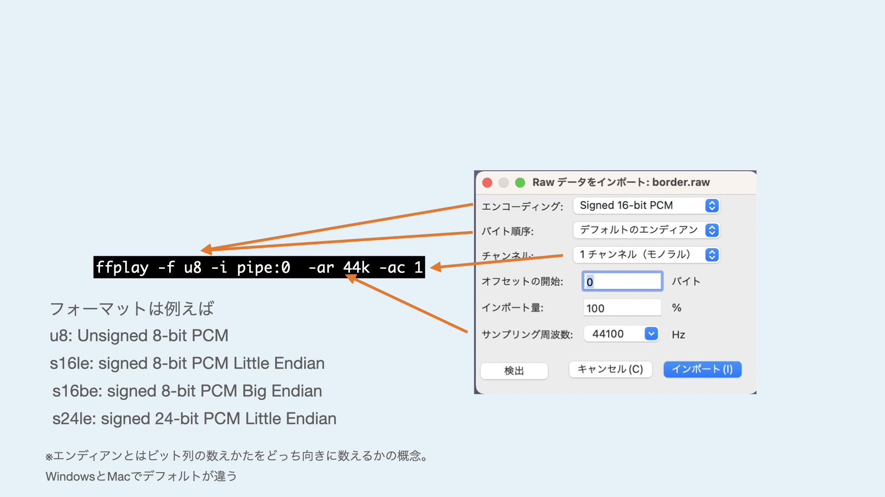
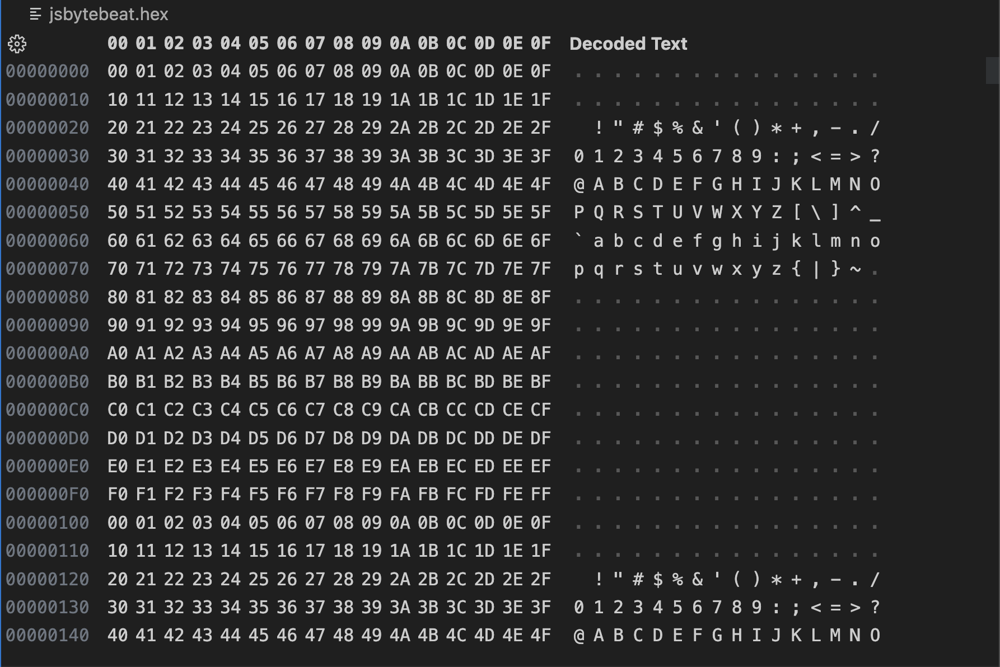
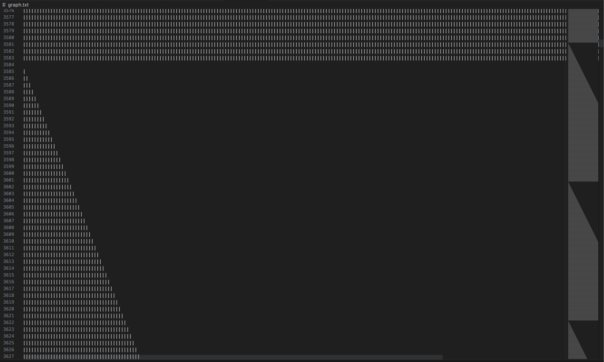

# 2023　Media Art Programming 2 Week 4

## スライド



Slide（PDF）

Slide（HTML）

## Shell and pipe

Previously we have used basic commands like `ls` and `cd`, which take terminal text input and return text output to the terminal.

On Unix-like operating systems, the input and output of commands with simple functions can be combined to perform complex operations using a feature called **pipes**.

Take, for example, the command `say`, which can be used on macOS to read text aloud.

The following command will cause macOS to say "Hello" aloud.


```sh
say "Hello".
```

Here, a program called say receives the text ``"hello"`` from standard input (stdin).

So what happens if there is no input at all?

```sh
say
````

When executed without input, the say command enters a mode in which it waits for text input. Here, typing "hello" and then pressing the Enter key will cause the command to read out the text. When it finishes reading, it waits for text input again.

Standard input is often given in the form of a first argument or otherwise entered by the user from the terminal when the program is executed.

A pipe can be used here to pass the result of another command to say as standard input.

```sh
echo "hello" | say
```

The ``echo`` command simply writes arbitrary text to standard output. say is executed without arguments as before, but instead of going into interactive mode, it reads the "hello" given by ``echo`` and exits.

Instead of `echo`, you can use a command that writes a file to standard output, such as `cat hogehoge.txt`, to read an arbitrary text file.

## Files and Devices

By the way, files on storage are not the only things that `cat` can open; Unix-like operating systems can also take hardware information on the computer (e.g., CPU temperature, hard disk RPM, etc.) just as they can handle files.

These devices reside in the `/dev` directory. This directory is not accessible from the Finder.

```sh
ls /dev
```

There are so many devices out there that it is difficult to guess their contents from their names, but devices connected via Bluetooth are a glimpse of what is possible. Let's try to use `urandom`, a hardware random number generator on a computer.

On computers, random numbers are often treated as algorithmic sequences of numbers, which means that knowing the initial value of a random number can predict subsequent random number sequences, so security-critical random number generation is often based on time or hardware random number generators.

Since opening with `cat` produces a tremendous number of random numbers and causes the terminal to freeze, let's use the head command to extract only the first few lines. Since `urandom` writes out random numbers as binary, it will include many that cannot be encoded as strings.

```sh
head /dev/urandom
```

And although it is not available now, in the past Linux had a virtual device called `/dev/dsp` that could write waveform data directly to the audio driver when written via pipe. Currently in Linux, the command `aplay` can do the same thing.

There is an attempt to take advantage of this mechanism, called **Bytebeat**, to generate sound in as short and simple a program as possible.

## Bytebeat



Bytebeat was first published by viznut in 2011 in a video on Youtube and spread through commentary on his blog.

[Algorithmic symphonies from one line of code -- how and why?(2011)](http://countercomplex.blogspot.com/2011/10/algorithmic-symphonies-from- one-line-of.html)

Later, several environments were created that allow similar code to be executed on a web browser.

https://greggman.com/downloads/examples/html5bytebeat/html5bytebeat.html

https://sarpnt.github.io/bytebeat-composer


Let's try Bytebeat the old-fashioned (?) way of actually creating binary data. Let's try it the old-fashioned (?) way of actually creating binary data.

Bytebeat was originally created with the following C program.

```c
main(t){for(;;t++)putchar(((t<<1)^((t<<1)+(t>>7)&t>>12))|t>>(4-(1^7&(t>>19)))|t>>7);}
```

This C code is compressed to the utmost limit, so if you write it a little more carefully, it will look like this.

```c
int main(int t){
    for(;;t++){
    putchar(((t<<1)^((t<<1)+(t>>7)&t>>12))|t>>(4-(1^7&(t>>19)))|t>>7);
    }
}
```

When a C program defines a function called `main`, it is the entry point for the program to execute.
In an infinite loop with `for`, `t` starts at 0 at the beginning of the program and is increased by 1 at each loop. So this is the virtual time.

`putchar` is one of the most primitive functions in C, writing a single byte of data to the standard output.
When this t is calculated with various operations, one byte of data (0~255) is output as the value of one sample waveform (≈voltage, air pressure).

Data written to `/dev/dsp` is interpreted as 1 byte 1 sample with a sampling rate of 8000 Hz.

This time, we will use Node.js instead of C, which is difficult to build an environment for, and a program called `ffmpeg` so that it can be run outside of Linux.

## What is ffmpeg?

`ffmpeg` is a tool for converting files and data streams of various formats.
For example, you can convert a wav file to an mp3 file, receive internet radio and export it to a file, or conversely, play an audio file and host internet radio.

Because of its modularity and ability to convert so many different formats, it is no exaggeration to say that ffmpeg is behind most of the distribution services in the world.

### Installing ffmpeg

You can install `ffmpeg` with Homebrew. Please note that it takes a long time because of many dependent libraries.

```sh
brew install ffmpeg
```

### ffmpegとffplayコマンド

`ffmpeg`をインストールすると、`ffplay`というコマンドも同時に使えるようになります。

`ffplay`はffmpegの後段をファイル書き出しやストリーミングではなくシステム上で再生するようにした、いわば万能オーディオ/ビデオ再生ツールです。

例えば普通のオーディオファイルの再生は次のようなコマンドで可能です。

```sh
ffplay hoge.wav
```

You can also listen to Internet radio. Open the following URL to receive NHK-FM (Tokyo). [^nhkurl]

[^nhkurl]: You can get a list of NHK web radio URLs here.http://www.nhk.or.jp/radio/config/config_web.xml

```sh
ffplay https://radio-stream.nhk.jp/hls/live/2023507/nhkradiruakfm/master.m3u8
```

During playback, the standard view of the frequency distribution is the spectrogram.


Pressing the w key with focus on this window allows you to switch between modes of waveform display. [^view]

[^view]: If you set the option `-showmode 0`, 0: video (hidden for audio files), 1: waveform, 2: spectrogram will be displayed.


### Listen to Audacity with ffmpeg

Last time, we did "Listen to Audacity with Audacity". If you do that again with ffplay, you will get the following command.

```sh
cat '/Applications/Audacity.app/Contents/MacOS/Audacity' | ffplay -f u8 -i pipe:0 -ar 44k -ac 1
```

This time, let's interpret the data as 1 byte per sample, a sample rate of 44100 (can be abbreviated as 44k), and the number of audio channels as mono.
Normally, ffplay will infer the format of the data from the file extension or file header, but this time, since we are reading the raw data directly, we need to specify the format as an option. This option corresponds directly to the "Import Raw Data" option we used in Audacity.



## Manipulate bytes with Javascript!

We've piped the raw byte data to ffplay and listened to it. Now it's time to create the code to generate the byte data.

Javascript inherently makes no distinction between numeric byte sizes, etc. (everything is handled in real numbers, 64-bit floating point format in many environments).

The only way to handle numerical data with a defined type is by using an array with a specified type, in this case `Uint8Array`.

With this method, it is a little difficult to continuously write to standard output, so let's first write the binary data to a file once, and then read it out with cat and pipe it as before.

The minimum program to create Bytebeat this time is as follows.

```js {title = "bytebeat.js"}
const fs = require("fs");
const sample_rate = 8000;
const seconds = 5;
const byte_length = sample_rate*seconds;
const bytebeat = t => 
    (t*(1+(5&t>>10))*(3+(t>>17&1?(2^2&t>>14)/3:3&(t>>13)+1))>>(3&t>>9))&(t&4096?(t*(t^t%9)|t>>3)>>1:255);

const data = Uint8Array.from({ length: byte_length },
    (v, t) => bytebeat(t)
);
fs.writeFile("jsbytebeat.hex",data, err => {} );
```

Take a look around.

```js
const fs = require("fs");
```

This line is loading the library for the final file write. Don't worry about it too much.

```js
const sample_rate = 8000;
const seconds = 5;
const byte_length = sample_rate*seconds;
```

The first two lines specify the sampling rate (how many samples per second of resolution to pack into the data) and the length of the audio waveform to be generated (in seconds).
Once these two values are determined, you know how many bytes of data should be generated in the end. That is the `length`.


```js
const bytebeat = t => 
    (t*(1+(5&t>>10))*(3+(t>>17&1?(2^2&t>>14)/3:3&(t>>13)+1))>>(3&t>>9))&(t&4096?(t*(t^t%9)|t>>3)>>1:255);
```

この行が最終的に波形を生成するBytebeatのプログラムです。この`=>`を使う書き方は関数定義の省略形です。

```js
function bytebeat(t) { 
    return (t*(1+(5&t>>10))*(3+(t>>17&1?(2^2&t>>14)/3:3&(t>>13)+1))>>(3&t>>9))&(t&4096?(t*(t^t%9)|t>>3)>>1:255);
}
```

This definition is exactly the same. Note that the above is the only way to omit return, although it is your preference. (Even in the above, return is still required if the `=>` is followed by curly braces `{}`.)


```js
const data = Uint8Array.from({ length: byte_length },
    (v, t) => bytebeat(t)
);
```

We will now create an array of unsigned 8-bit integers. There are many ways to do this, but in this case we will use the `from` method to specify the `length` and initialization function.

In `{length:byte_length}`, we specify that we want to create an array of 8000*5=400000 samples, which we calculated earlier.

 `(v, t) => bytebeat(t)` is an initialization process that takes the index of an array called t, puts it into the bytebeat function, and stores the converted values in the array in order.

```js
fs.writeFile("jsbytebeat.hex",data, err => {} );
```

At this point, finally, save the resulting byte sequence. The third argument, `err => {}`, indicates that no action is to be taken in error handling. The third argument, `err => {}`, refers to doing nothing in error handling.

Now, let's run this as `bytebeat.js` in the terminal.
At this time, remember that the `-ar` option in ffplay should match the sampling rate specified in the source code.


```sh
node bytebeat.js
cat jsbytebeat.hex | ffplay -f u8 -i pipe:0  -ar 8k -ac 1
```

Hopefully, 5 seconds of audio should play and stop.

You can also output it again as a wav file with ffmpeg instead of ffplay.。

```sh
cat jsbytebeat.hex | ffmpeg -f u8 -ar 8k -i pipe:0 -c:a pcm_u8 -ac 1  -y jsbytebeat.wav
```


### Let's take a simple observation of the waveform

Let's try the bytebeat function as a function that just returns t as it is.

```js
const bytebeat = t => 
    t
```

At this time, the value of t itself keeps rising without limit up to several hundred thousand, but when it is finally written to `Uint8Array`, only the lower 8 bits of the integer portion are written. What this means is that after rising from 0 to 255, it returns to 0 again.

If you open this `jsbytebeat.hex` with 0~255 written in it with VSCode's Hex Editor, it looks like the following.



You can see that the numbers rise in sequence from 00 to FF (255) and back to 00 again.

However, it is difficult to understand what kind of waveform is being generated just by looking at the binary directly in the Hex Editor.

You can export the data to ffmpeg and view it in Audacity, or use ffplay's waveform display mode, but since we are here, let's plot the data in a simple way.

Add the following line to the second half of bytebeat.js as shown above.

```js
let file = fs.createWriteStream("graph.txt");
for (byte of data){
    let txt = "";
    for (i = 0; i < byte; i++) {
        txt += "|";
    }
    txt += "\n";
    file.write(txt);
}
file.end();
```

The code above reads one byte of the `data` array, writes a character (|) for the numerical value of the data, breaks the line, reads the next byte again ......, and repeats to create a file called graph.txt.

Now when you run `node bytebeat.js` again, it will create `graph.txt` in the directory.

If you open this in VSCode, it should look like this.



Although the display varies depending on the character size and text wrapping settings, the sawtooth waveform is plotted by increasing the number of characters by one per line.

### Let's make it run continuously.

WIP...

```js
const { setTimeout } = require('timers/promises');
const sample_rate = 8000;
const seconds = 5;
const length = sample_rate * seconds;
const bytebeat = t =>
    (((t >> 10 ^ t >> 11) % 5)* t>>16)* ((t >> 14 & 3 ^ t >> 15 & 1) + 1) * t % 99 + ((3 + (t >> 14 & 3) - (t >> 16 & 1)) / 3 * t % 99 & 64);
let t = 0;
(async () => {
    while (true) {
        const data = Uint8Array.from({ length: length },
            (v, _t) => {
                const res = bytebeat(t);
                t += 1;
                return res
            }
        );
        process.stdout.write(data);
        await setTimeout(seconds / 1000.0);
    }
})()

```