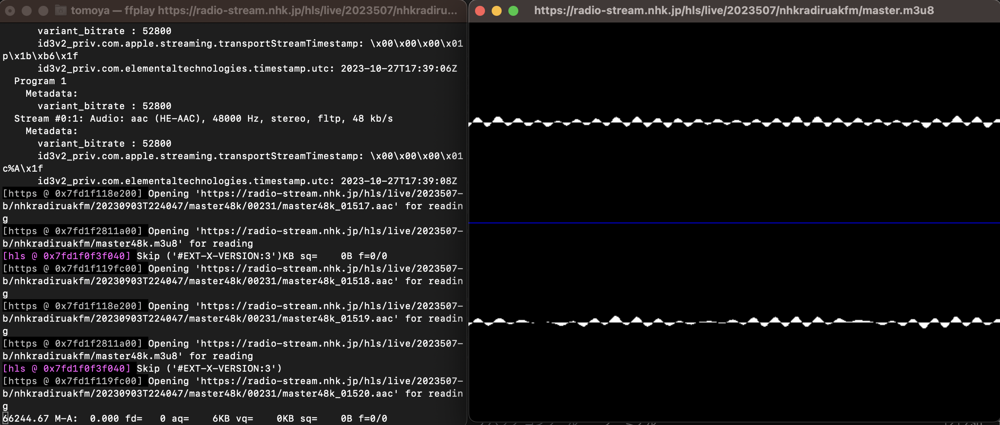
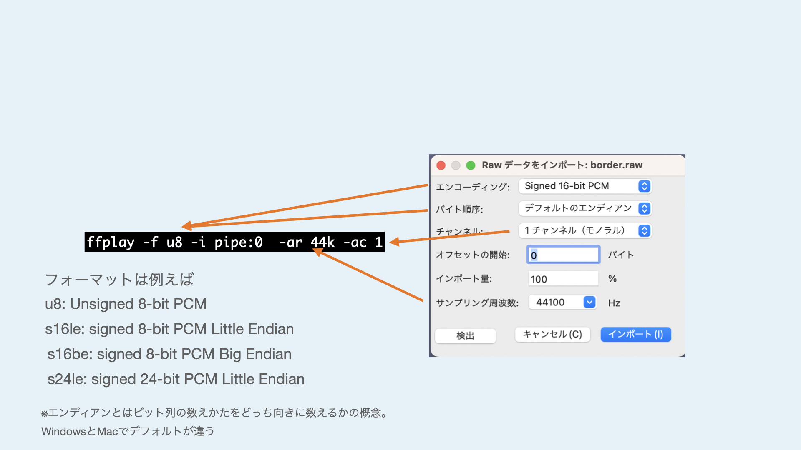
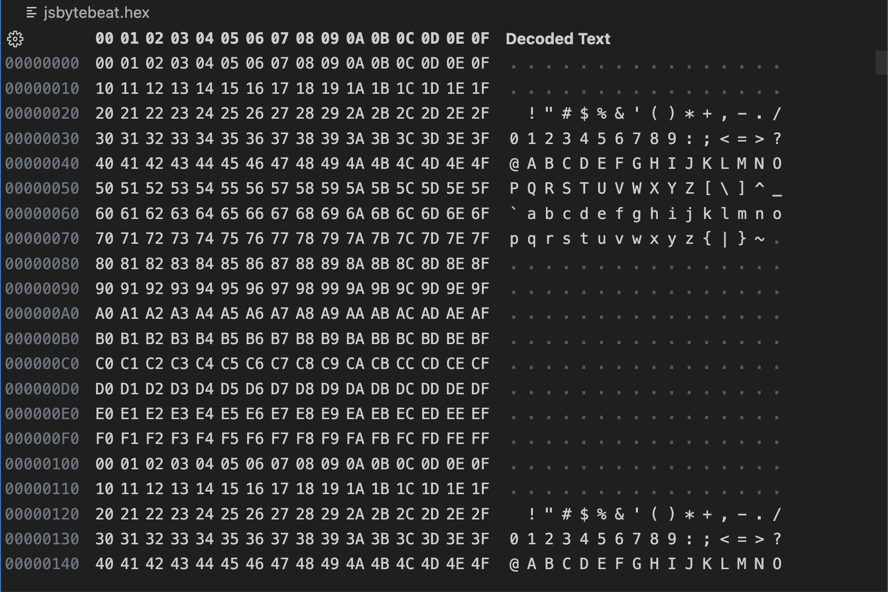
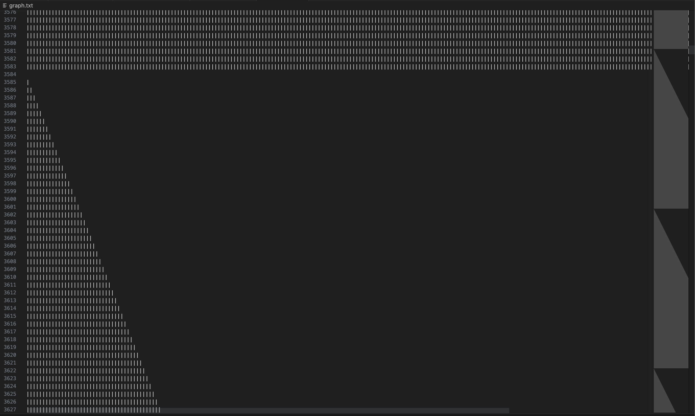

# 2023年　メディアアート・プログラミング 第4回

## スライド



スライド（PDF）

スライド（HTML）

## シェルとパイプ

前回まで`ls`や`cd`のような基礎コマンドを使ってきましたが、これらはターミナルのテキスト入力を受け取るとターミナルにテキスト出力を返すものでした。

Unix系のOSでは、単純な機能を持つコマンドの入出力を**パイプ**と呼ばれる機能を使い、組み合わせて複雑な処理を実行できます。

例えばmacOSで使えるテキストを音声で読み上げるコマンド`say`を例にしましょう。

次のコマンドを実行すると、macOSが音声で”こんにちは”と喋ってくれます。

```sh
say "こんにちは"
```

ここでは、sayというプログラムが**標準入力（stdin）**から`"こんにちは"`というテキストを受け取っています。

では、入力が全くないとどうなるでしょうか？

```sh
say
```

このように入力なしで実行すると、sayコマンドはテキスト入力を待機するモードになります。ここで、"こんにちは"と入力してからEnterキーを押すと読み上げが発生します。読み上げ終わると再度テキスト入力を待機します。

標準入力は多くの場合、第1引数の形で与えられるか、そうでなければプログラム実行時にユーザーがターミナルから入力するような形をとります。

ここでパイプを使うと、別のコマンドの結果を標準入力としてsayに渡すことができます。

```sh
echo "こんにちは" | say
```

`echo`は単に任意のテキストを標準出力に書き込むコマンドです。sayは先ほど同様に引数なしで実行しましたが、対話モードにはならず`echo`から与えられた"こんにちは"を読んで終了します。

`echo`の代わりに`cat hogehoge.txt`のようなファイルを標準出力に書き出すコマンドを使えば、任意のテキストファイルを読み上げさせることもできます。

## ファイルとデバイス

ところで、`cat`が開けるものはストレージ上のファイルだけではありません。Unix系のOSはファイルを扱うのと同じようにコンピューター上のハードウェア情報（例えばCPUの温度や、ハードディスクの回転数など）を取ることもできます。

こうしたデバイスは`/dev`ディレクトリに存在します。このディレクトリはFinderなどから覗くことはできません。

```sh
ls /dev
```

たくさんのデバイスがありますが、名前から内容を推測することは難しいです。Bluetoothで繋がってるデバイスなどはその片鱗が伺えます。ここでは試しに、コンピューター上に搭載されているハードウェア乱数生成機`urandom`を使ってみましょう。

コンピューター上では乱数をアルゴリズミックな数列として扱うことが多いですが、これは乱数の初期値を知っていると続く乱数列を予測できてしまうことでもあるため、セキュリティ的に重要な乱数の生成は時刻やハードウェア乱数生成機を元に使うことが多いのです。

`cat`で開くとものすごい数の乱数が出てターミナルが固まってしまうので、最初の数行だけを取り出すheadコマンドを使ってみましょう。`urandom`はバイナリとしての乱数を書き出すため、文字列としてエンコードできないものもたくさん含まれてきます。

```sh
head /dev/urandom
```

そして、現在は使えないものの、昔のLinuxには`/dev/dsp`という、パイプで書き込むと直接オーディオドライバに波形データを書き込める仮想デバイスが存在しました。現在Linuxでは`aplay`というコマンドで同様のことができます。

この仕組みを活用して、できるだけ短く単純なプログラムで音を生成する**Bytebeat**という試みがあります。

## Bytebeat



Bytebeatは2011年にviznutがYoutube上の動画で公開し、自身のブログの解説などで広がっていったものです。

[Algorithmic symphonies from one line of code -- how and why?(2011)](http://countercomplex.blogspot.com/2011/10/algorithmic-symphonies-from-one-line-of.html)

その後、Webブラウザ上でも同様のコードを実行できる環境がいくつか誕生しました。

https://greggman.com/downloads/examples/html5bytebeat/html5bytebeat.html

https://sarpnt.github.io/bytebeat-composer


今回はBytebeatを、実際にバイナリデータを作る昔ながらの（？）やり方でやってみましょう。

Bytebeatは元々次のようなC言語のプログラムで作られていました。

```c
main(t){for(;;t++)putchar(((t<<1)^((t<<1)+(t>>7)&t>>12))|t>>(4-(1^7&(t>>19)))|t>>7);}
```

このC言語のコードは極限まで圧縮されているのでもうちょっと丁寧に書くとこうなります。

```c
int main(int t){
    for(;;t++){
    putchar(((t<<1)^((t<<1)+(t>>7)&t>>12))|t>>(4-(1^7&(t>>19)))|t>>7);
    }
}
```

C言語のプログラムは`main`という関数を定義するとそれがプログラムで実行される入り口になります。
`for`による無限ループの中で、`t`がプログラム開始時には0でスタートし、ループごとに1増えています。これが仮想的な時間になるわけですね。

`putchar`は標準出力に1バイトのデータを書き込む、C言語の中でも最も原始的な関数の1つです。
このtを様々な演算で計算すると、1バイト分のデータ（0~255）がある1サンプルの波形の値（≒電圧、空気圧）になって出力されます。

`/dev/dsp`に書き込んだデータは1バイト1サンプル、サンプリングレート8000Hzとして解釈されます。

今回は、環境構築が大変なC言語の代わりにNode.jsを使い、Linux以外でも実行できるように`ffmpeg`というプログラムを使用します。

## ffmpegとは

`ffmpeg`は様々なフォーマットのファイルやデータストリームを変換するためのツールです。
例えばwavファイルをmp3ファイルに変換したり、インターネットラジオを受信してファイルに書き出したり、逆に音声ファイルを再生してインターネットラジオをホストするようなこともできます。

非常に多種多様なフォーマットの変換が可能でモジュラーな作りになっているため、世の配信サービスの裏側では大抵ffmpegが動いていると思っても過言ではありません。

### ffmpegのインストール

`ffmpeg`はHomebrewでインストールできます。依存ライブラリが多いため時間がかかるので注意してください。

```sh
brew install ffmpeg
```

### ffmpegとffplayコマンド

`ffmpeg`をインストールすると、`ffplay`というコマンドも同時に使えるようになります。

`ffplay`はffmpegの後段をファイル書き出しやストリーミングではなくシステム上で再生するようにした、いわば万能オーディオ/ビデオ再生ツールです。

例えば普通のオーディオファイルの再生は次のようなコマンドで可能です。

```sh
ffplay hoge.wav
```

また、インターネットラジオも聞けます。以下のURLを開くとNHK-FM（東京）を受信できます。[^nhkurl]

[^nhkurl]: NHKのWebラジオのURL一覧はここから取得できます。　http://www.nhk.or.jp/radio/config/config_web.xml

```sh
ffplay https://radio-stream.nhk.jp/hls/live/2023507/nhkradiruakfm/master.m3u8
```

再生中は標準ではスペクトログラムという周波数分布のビューが表示されます。


このウィンドウにフォーカスをした状態でwキーを押すと、波形表示のモードと切り替えができます。[^view]

[^view]: オプションで`-showmode 0`のようにすると0:ビデオ（音声ファイルの場合非表示）、1:波形、2:スペクトログラム が表示されます。




### Audacityをffmpegで聴く

前回、「AudacityでAudacityを聴く」というのをやりました。あれをもう一度ffplayでもやると次のようなコマンドになります。

```sh
cat '/Applications/Audacity.app/Contents/MacOS/Audacity' | ffplay -f u8 -i pipe:0 -ar 44k -ac 1
```

今回は、データを1バイト1サンプル、サンプルレートは44100（44kと省略できます）、オーディオチャンネル数はモノラルとして解釈しましょう。
通常、ffplayは拡張子やファイルのヘッダーからデータのフォーマットを推定しますが、今回は生のデータを直接読むので、オプションとしてフォーマットを指定してあげる必要があります。このオプションは、前回Audacityでやった時の"Rawデータをインポート"のオプションと直接的に対応しています。



## Javascriptでバイト列を操作しよう

生のバイトデータをffplayにパイプして聴くことはできました。それではいよいよバイトデータを生成するコードを作っていきましょう。

Javascriptは本来、数値のバイトサイズなどの区別がありません（全て実数、多くの環境では64bit浮動小数点のフォーマットで扱われます）。

唯一、数値データの型を決めて扱う方法として、型を指定した配列、今回の場合は`Uint8Array`を使うことで実現できます。

この方法だと連続して標準出力に書き込み続けるのが少し難しいため、まず一度ファイルにバイナリデータを書き出して、それを先ほどと同じくcatで読み出してパイプしてみましょう。

今回Bytebeatを作る最小のプログラムは次のようなものになります。

```js {title = "bytebeat.js"}
const fs = require("fs");
const sample_rate = 8000;
const seconds = 5;
const byte_length = sample_rate*seconds;
const bytebeat = t => 
    (t*(1+(5&t>>10))*(3+(t>>17&1?(2^2&t>>14)/3:3&(t>>13)+1))>>(3&t>>9))&(t&4096?(t*(t^t%9)|t>>3)>>1:255);

const data = Uint8Array.from({ length: byte_length },
    (v, t) => bytebeat(t)
);
fs.writeFile("jsbytebeat.hex",data, err => {} );
```

順番にみていきましょう。

```js
const fs = require("fs");
```

この行は、最終的にファイル書き込みをするためのライブラリの読み込みです。あまり気にしなくても大丈夫です。

```js
const sample_rate = 8000;
const seconds = 5;
const byte_length = sample_rate*seconds;
```
はじめ2行は、サンプリングレート（1秒間あたり何サンプルの解像度でデータを詰め込むか）の指定、生成する音声波形の長さを何秒にするかを決めています。
この2つの値が決まれば、データを最終的に何バイト生成すればいいかがわかります。それが`length`です。

```js
const bytebeat = t => 
    (t*(1+(5&t>>10))*(3+(t>>17&1?(2^2&t>>14)/3:3&(t>>13)+1))>>(3&t>>9))&(t&4096?(t*(t^t%9)|t>>3)>>1:255);
```

この行が最終的に波形を生成するBytebeatのプログラムです。この`=>`を使う書き方は関数定義の省略形です。

```js
function bytebeat(t) { 
    return (t*(1+(5&t>>10))*(3+(t>>17&1?(2^2&t>>14)/3:3&(t>>13)+1))>>(3&t>>9))&(t&4096?(t*(t^t%9)|t>>3)>>1:255);
}
```
この定義でも全く同じです。書き方は好みですが、returnを省略できるのは上の書き方の方だけなので注意してください（上の書き方でも、`=>`の後を中括弧`{}`で囲む場合は、やはりreturnが必須です）。


```js
const data = Uint8Array.from({ length: byte_length },
    (v, t) => bytebeat(t)
);
```
ここでunsigned 8bit 整数の配列を作成します。やり方にはいろいろありますが、今回は`from`メソッドで`length`と初期化関数を指定する方法を使いましょう。

`{length:byte_length}`では先ほど計算した8000*5=40000サンプル分の配列を生成することを指定しています。

 `(v, t) => bytebeat(t)`は、tという配列のインデックスを取得してbytebeat関数に入れて変換したものを配列に順番に収めていく、という初期化の処理です。

```js
fs.writeFile("jsbytebeat.hex",data, err => {} );
```

ここでようやく、出来上がったバイト列を保存します。`"jsbytebeat.hex"`は好きなファイル名で問題ありませんが、特にフォーマットの決まっていないバイナリファイルなら拡張子は`.bin`や`.hex`などを使うことが多いです。3つ目の引数である`err => {}`はエラー処理で何もしないことを指しています。

では、これを`bytebeat.js`として、ターミナルで実行しましょう。
この時、ffplayでの`-ar`オプションはソースコード内で指定したサンプリングレートと一致させることを忘れないようにしましょう。


```sh
node bytebeat.js
cat jsbytebeat.hex | ffplay -f u8 -i pipe:0  -ar 8k -ac 1
```

うまくいけば、5秒分の音声が再生されて停止するはずです。

ffplayの代わりにffmpegでwavファイルとして改めて出力することもできます。

```sh
cat jsbytebeat.hex | ffmpeg -f u8 -ar 8k -i pipe:0 -c:a pcm_u8 -ac 1  -y jsbytebeat.wav
```


### 波形を簡易的に観察してみよう

試しにbytebeat関数をtをそのまま返すだけの関数としてみます。

```js
const bytebeat = t => 
    t
```

この時、tの数値自体は数十万などまで際限なく上昇し続けますが、最終的に`Uint8Array`に書き込まれるときには整数部分下位8bitのみが書き込まれます。どういうことかというと、0~255まで上昇するとまた0に戻るのです。

この、0~255を書き込んだ`jsbytebeat.hex`をVSCodeのHex Editorで開くと次のような見た目をしています。



00からFF(255)まで順番に数値が上昇して、また00に戻っているのがわかります。

しかし、バイナリを直接Hex Editorで見るだけではあまりにどんな波形が生成されてるのかわかりにくいです。

ffmpegで書き出してAudacityで見たり、ffplayの波形表示モードを使うこともできるのですが、せっかくなので、簡単な方法でデータをプロットしてみることにしましょう。

先ほどのbytebeat.jsの後半に以下の行を追加します。

```js
let file = fs.createWriteStream("graph.txt");
for (byte of data){
    let txt = "";
    for (i = 0; i < byte; i++) {
        txt += "|";
    }
    txt += "\n";
    file.write(txt);
}
file.end();
```

上のコードは、`data`の配列を1バイト分読み取り、データの数値の分だけ文字（|）を書いて、改行し、また次の1バイトを読む……というのを繰り返し、graph.txtというファイルを作っています。

これで`node bytebeat.js`を改めて実行すると、ディレクトリに`graph.txt`が作られます。

これをVSCodeで開くとこんな感じになるはず。



文字数の大きさや、テキストの折り返し設定によってい表示は異なりますが、1行ごとに1文字ずつ増えることでノコギリ状の波形がプロットできています。

### 連続して実行できるようにしよう

WIP...

```js
const { setTimeout } = require('timers/promises');
const sample_rate = 8000;
const seconds = 5;
const length = sample_rate * seconds;
const bytebeat = t =>
    (((t >> 10 ^ t >> 11) % 5)* t>>16)* ((t >> 14 & 3 ^ t >> 15 & 1) + 1) * t % 99 + ((3 + (t >> 14 & 3) - (t >> 16 & 1)) / 3 * t % 99 & 64);
let t = 0;
(async () => {
    while (true) {
        const data = Uint8Array.from({ length: length },
            (v, _t) => {
                const res = bytebeat(t);
                t += 1;
                return res
            }
        );
        process.stdout.write(data);
        await setTimeout(seconds / 1000.0);
    }
})()

```